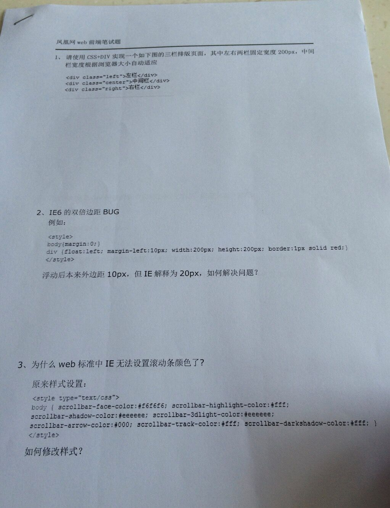
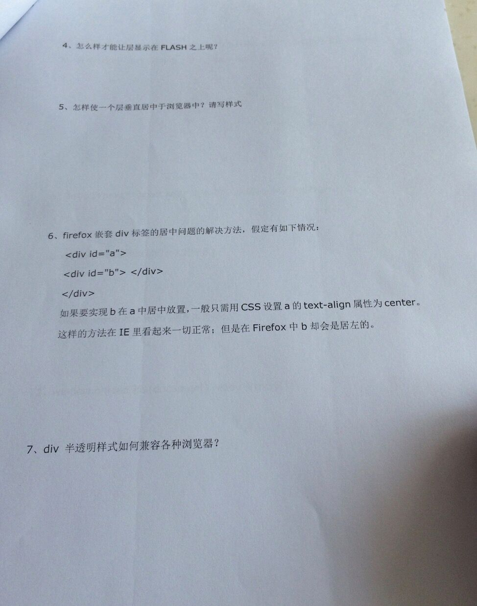
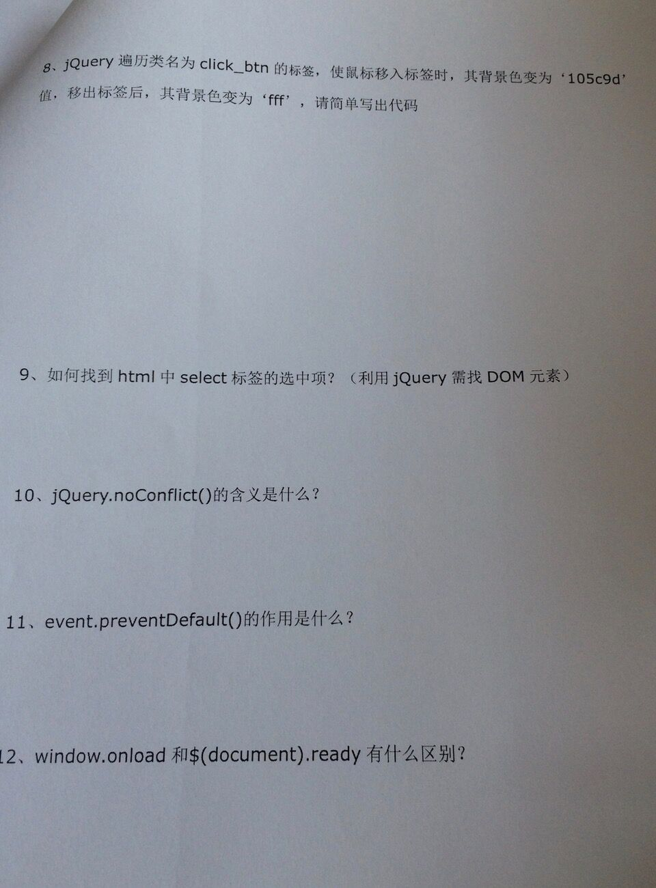

# 凤凰网web前端笔试题

----------

10.释放$标识符的控制，这样其他脚本就可以使用它。   
11.阻止元素发生默认的行为（例如，当点击提交按钮时阻止对表单的提交）。   
12.

- 1.执行时间 

window.onload必须等到页面内包括图片的所有元素加载完毕后才能执行。   
$(document).ready()是DOM结构绘制完毕后就执行，不必等到加载完毕。 

- 2.编写个数不同 

window.onload不能同时编写多个，如果有多个window.onload方法，只会执行一个。   
$(document).ready()可以同时编写多个，并且都可以得到执行。 

- 3.简化写法 

window.onload没有简化写法。   
$(document).ready(function(){})可以简写成$(function(){});